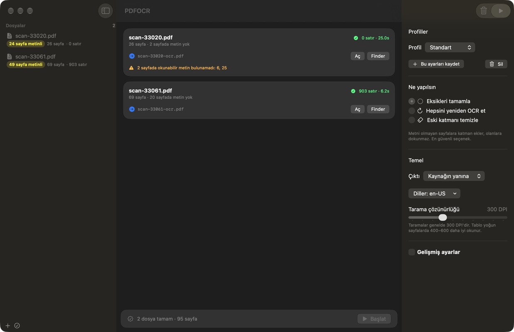

# PDFOCR

Add a searchable text layer to scanned PDFs, using the text recognition that
already ships with macOS. No cloud service, no API key, no Python.



Each page is replayed into a fresh PDF page with the scan untouched, and the
recognized text is written on top in invisible render mode. The page looks
exactly as it did; it is now selectable, searchable and copyable, and the
scan is never recompressed.

macOS 26 or newer. Swift, no third-party dependencies.

## Install

```sh
git clone https://github.com/myaworks/PDFOCR
cd PDFOCR
swift build -c release
cp .build/release/pdf-ocr /usr/local/bin/   # needs sudo, or any dir on PATH
```

Or grab `pdf-ocr` from the [releases page](https://github.com/myaworks/PDFOCR/releases)
and drop it somewhere on your PATH.

### The app

```sh
Scripts/build-app.sh            # -> dist/PDFOCR.app, universal
open dist/PDFOCR.app
```

SwiftPM builds a bare executable; a SwiftUI app needs the bundle around it
before Finder will treat it as an app, which is all this script does. Pass
`--arch arm64` for a faster single-architecture build, `--version 1.2.3` to
stamp a version.

Releases carry both: `PDFOCR-macos.zip` (the app) and a universal
`pdf-ocr-macos-universal.tar.gz` (the CLI). The app is ad-hoc signed, which
is enough to run it on the machine that built it — for other machines it
needs a Developer ID and notarisation.

## Use

```sh
pdf-ocr scan.pdf                       # writes scan-ocr.pdf next to the source
pdf-ocr *.pdf -o ~/clean/              # a directory works for several files
pdf-ocr scan.pdf --pages 1-20 --lang tr-TR
pdf-ocr scan.pdf --redo-text -o fixed.pdf
```

`pdf-ocr --help` lists every option. The ones that matter most:

| Option | What it does |
|---|---|
| `-o, --output` | Output file, or a directory for several inputs |
| `--pages` | `1-10, 15, 20-` — an open upper bound means "to the end" |
| `--redo-text` | Also re-read pages that already have a text layer |
| `--replace-text` | Drop the existing text layer first; see the caveat below |
| `--lang` | Comma separated recognition languages, e.g. `tr-TR,en-US` |
| `--dpi` | Rasterization resolution, default 300 |
| `--font unicode` | Embed a subset font so characters outside Latin-1 survive |
| `--text` | Also write a plain-text transcription |

### The app

`swift run -c release PDFOCR` builds and opens the GUI. Drop PDFs on the
window, or press ⌘O.

Each file shows how much of it already has a text layer — that decides what
should happen to it:

| Mode | When it makes sense |
|---|---|
| **Eksikleri tamamla** | Most files. Adds a layer only to pages that lack one and leaves everything else alone. |
| **Hepsini yeniden OCR et** | A file that is already fully searchable but you do not trust the existing text. Keeps the old layer, so both show up in search. |
| **Eski katmanı temizle** | An existing layer so bad it is worse than none. Removes it. |

The app picks the recommended mode per file and you can change it.

**The caveat on "Eski katmanı temizle":** a page's text layer lives inside its
content stream, so removing it means laying the page down as a bitmap. The
result is pixel-identical for a scan, but highlights, vector text and other
annotations on that page are lost, and the file gets larger. Pages without an
existing text layer are never affected.

## How the text layer is drawn

The recognized text goes into the page in PDF render mode 3, which is the
standard "invisible text" trick — the glyphs are positioned correctly so
selection highlights land on the ink, but nothing is painted.

Two details that are easy to get wrong:

- **Ligatures.** Shaping a line as a whole makes CoreText fold `fi`, `ff` and
  `fl` into the single characters `U+FB01`/`FB02`/`FB03`. No PDF base-14
  encoding has a code for those, so the word lands in the file as something no
  search will match — `defined` stops being findable. Each line is therefore
  split at its ligature opportunities and drawn in pieces, so no piece can be
  folded.
- **Font coverage.** The base-14 fonts cover Latin-1 only. Turkish `ş`/`ğ`,
  Greek and Cyrillic need `--font unicode`, which embeds a subset. The tool
  warns you when characters have been dropped.

`/Rotate` on a page is honoured, so phone-scanned PDFs come out the right way
up.

## What is not carried over

Bookmarks, form fields, link annotations and the document outline belong to the
source file, not to a page's content stream, and are not copied. This is a
text-layer tool, not a PDF editor.

## Development

```sh
swift build
swift test
```

`PDFOCRKit` holds the pipeline and has no UI; `pdf-ocr` is the command line
front end; `PDFOCRApp` is SwiftUI. The tests cover the ligature splitting, the
default output path, page ranges, and a full round trip from a synthetic scan.

## Licence

MIT. See [LICENSE](LICENSE).